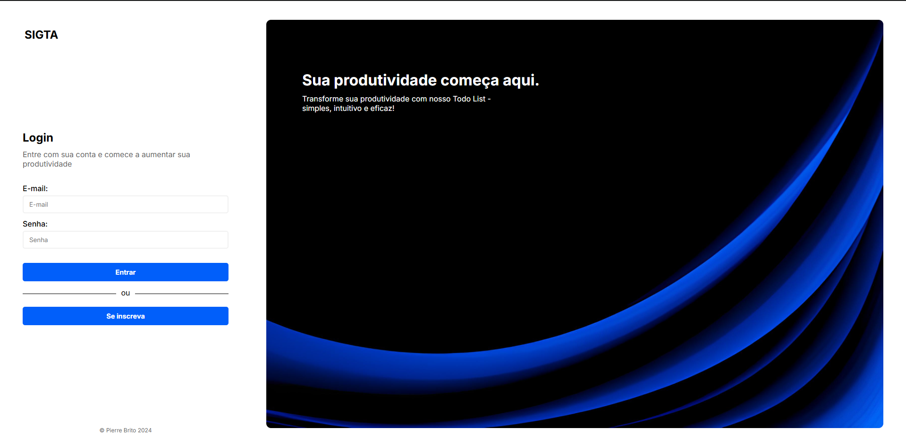

# SIGTA
Task Management System that simulates a personal ToDo List.

### A - Java Web Application using JavaServer Faces (JSF).

### B - PostgreSQL database for persistence.

### C - Using JPA with Hibernate implementation.

### D - Some unit tests were done with JUnit5 mainly on the models.

### E - Deployed in a cloud environment Heroku.

### F
- `Authentication`: Using sessions and the User table.
- `Notes`: Every task has a list of related notes.
- `Archiving`: A task can be archived, making it impossible to edit (only deletion is allowed).
- `Progress`: A progress bar in relation to the completion of non-archived tasks.

## Local development environment
- IDE Eclipse.
- JDK 8
- Apache Tomcat 7.0 server
- PostgreSQL (latest version)
- Maven as dependency and build tool
- Maven project configuration with JSF 2.2 and Hibernate 5.2.6

## Local installation steps
1. Download the zip and unzip or clone from GitHub;
2. Perform a `Maven update`
2. Ensure all these configurations in the project properties are correct:
 - `Java Compiler`: set to 1.8;
 - `Build Path`: includes Maven Dependencies, JUnit5, and Server Runtime;
 - `Deployment Assembly`: includes Maven Dependencies and JUnit5;
3. Configure `persistence.xml` in `src\main\resources\META-INF\` to point to the correct database properties, local or production (already included in the project);
4. Add to the server running in Eclipse;
4. Start the server.

## Data Dictionary

### Tables

#### User
- `id` (integer, primary key): User ID
- `username` (varchar): Username
- `password` (varchar): User password
- `email` (varchar): User email

#### Task
- `id` (integer, primary key): Task ID
- `title` (varchar): Task title
- `description` (text): Task description
- `status` (varchar): Task status (e.g., pending, completed, archived)
- `user_id` (integer, foreign key): ID of the user who created the task

#### Note
- `id` (integer, primary key): Note ID
- `content` (text): Note content
- `task_id` (integer, foreign key): ID of the related task

### Relationships
- One `User` can have many `Tasks`.
- One `Task` can have many `Notes`.
